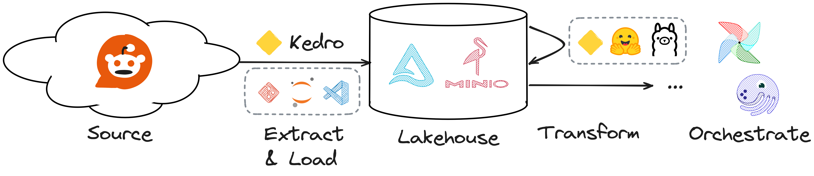

# Who needs ChatGPT? Rock solid AI pipelines with Hugging Face and Kedro


Material for the workshop "Who needs ChatGPT? Rock solid AI pipelines with Hugging Face and Kedro".

[](https://gitpod.io/#https://github.com/ArnoutVerboven/workshop-kedro-huggingface/)



## Links

- Kedro documentation https://docs.kedro.org/en/0.19.3/


## Run

Activate virtual environment

```bash
source .venv/bin/activate
```

Move to Kedro project

```bash
cd reddit-analytics
```

Make sure you have created [Reddit credentials](https://www.reddit.com/prefs/apps) and added them to the environment

```bash
export REDDIT_CLIENT_ID=<YOUR CLIENT ID>
export REDDIT_SECRET=<YOUR SECRET>
export REDDIT_USERNAME=<YOUR USERNAME>
```

You can now run the default pipeline or a specific pipeline with

```bash
kedro run
```

```bash
kedro run --pipeline summarizer
```

Or visualize the pipeline

```bash
kedro viz run
```


To create a new pipeline 

```
kedro pipeline create <pipeline_name>
```